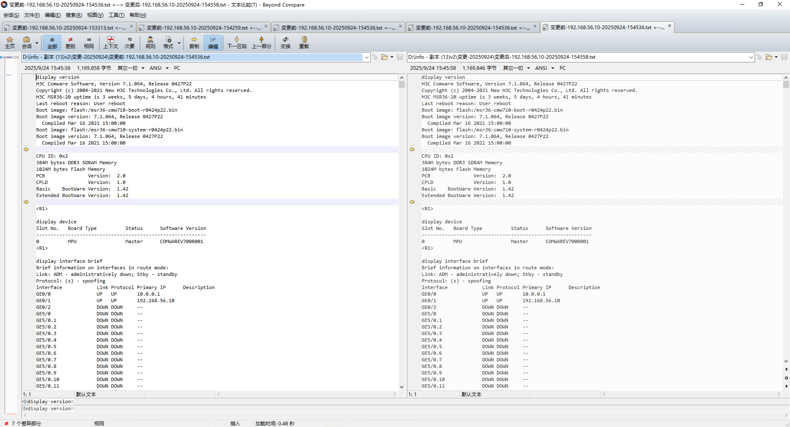

# 网络变更信息采集工具

一个基于 PyQt5 的桌面应用，用于通过 SSH 或 Telnet 登录网络设备，执行批量命令并将输出按规则落盘，支持大输出量与文件比对（Beyond Compare）。

## 功能特性

- 图形界面（PyQt5）：登录信息、模式选择（变更前/变更后）、进度与日志、结果文件列表、比对按钮
- 协议支持：SSH（paramiko）、Telnet（telnetlib）
- 大输出优化：高性能字节读写、提示符检测、尾部窗口匹配、静默探测、输出上限控制
- 缓冲与落盘：内存缓冲 5MB，单次运行总输出 50MB，上限内多次刷盘，避免内存暴涨
- 命令管理：从可选文本文件读取命令，自动编码检测（chardet）
- 输出规范：每条命令输出格式统一（命令行 + 回显 + 空行），去除冗余回显
- 结果对比：集成 Beyond Compare 路径配置与自动查找
- 统计信息：耗时、速率、字节量、成功/失败条数

## 目录结构

- main.py — 应用入口（创建 QApplication，启动主窗体）
- ui.py — 主窗体与交互逻辑（命令选择、开始采集、文件比对、日志与进度）
- config_loader.py — 配置加载与初始化（config.ini）
- config.ini — 默认保存 Beyond Compare 可执行文件路径
- command.txt — 默认命令文件示例
- requirements.txt — 依赖清单
- connection/ — 连接与执行模块
  - __init__.py — 导出统一接口
  - connection_worker.py — 高性能工作线程（协调连接、执行、写盘、信号）
  - ssh_connection.py — SSH 连接与执行
  - telnet_connection.py — Telnet 连接与执行
  - buffer_manager.py — 缓冲与文件写入
  - utils.py — 工具函数（命令类型、提示符检测、输出格式化、预处理日志等）
  - README.md — Connection 子模块说明

## 依赖

requirements.txt：
- PyQt5==5.15.9
- paramiko==3.3.1
- chardet==5.2.0

系统要求：
- Windows 10/11（已在 Windows 环境下开发与测试）
- Python 3.8+（建议）

## 安装与运行

1) 创建虚拟环境并安装依赖
- python -m venv venv
- venv\Scripts\pip install -r requirements.txt

2) 运行
- python .\main.py

首次启动若无控制台输出属正常（GUI 程序）。界面中可选择命令文件、填写登录信息、选择模式并开始采集。

## 使用说明

1) 登录信息
- 协议：SSH 或 Telnet（单选）
- IP 与端口：支持“IP:端口”格式；未填端口时，SSH=22、Telnet=23
- 用户名/密码：用于登录设备

2) 命令文件
- 顶部“选择文件”可替换待执行命令文件，默认 command.txt
- 支持多种编码，自动检测（失败时按常见编码回退）

示例（command.txt）：
display version
display device
display interface brief
...

3) 执行与进度
- 点击“开始采集”，下方进度与日志更新
- 完成后“文件列表”显示生成文件，可双击查看
- “文件比对”按钮在各列表至少有一条记录时可用

4) 文件比对（Beyond Compare）
- 优先读取 config.ini 中的 beyond_compare_path
- 若未配置或无效，自动从注册表与常见路径尝试查找
- 找到后可一键对比选中的“变更前/变更后”文件

config.ini 示例：
[DEFAULT]
beyond_compare_path = D:\Program Files\Beyond Compare 4\BCompare.exe

## 输出规则与命名

- 输出目录：默认以当天日期生成，如 变更-20250924
- 文件名：{模式}-{IP}-{时间戳}.txt，例如 变更前-192.168.1.1-20250924-153000.txt
- 单条命令输出格式（由 ConnectionUtils.format_command_output 统一）：
  命令行
  回显内容
  [空行分隔]

- 终端预处理（SSH/Telnet）：尝试 terminal length 0 / screen-length 0 / screen-length disable / terminal width 512 等，尽量关闭分页与扩宽

## 架构与流程

- UI 层（ui.py）
  - 读取命令文件（chardet 自动识别编码）
  - 启动 HighPerformanceConnectionWorker 线程
  - 接收进度/完成/错误信号，刷新界面并展示结果
  - 调用 Beyond Compare 进行文件比对

- 连接层（connection/）
  - connection_worker.py
    - 启动时验证参数，建立 SSH/Telnet 连接
    - 按序执行命令，区分大数据量命令设置更长超时
    - 将输出统一格式化后写入 BufferManager（分块写盘）
    - 完成后汇总统计并通过信号返回
    - 信号：
      - progress_signal(int, str)
      - finished_signal(str, bool, str, dict) 备注：UI 的槽函数只接前 3 个参数，PyQt 允许多余参数被忽略
      - error_signal(str, str)

  - ssh_connection.py
    - paramiko SSHClient + invoke_shell（term=vt100, width=512）
    - 字节级提示符检测与尾部窗口匹配
    - 静默探测与轻量回车拉取提示符
    - 输出上限约 48MB（为上层 50MB 总限预留空间）

  - telnet_connection.py
    - 登录流程：匹配登录/密码提示，错误判定，提示符检测（str/bytes 双正则）
    - 高吞吐读取、尾部窗口检测提示符、静默探测
    - 输出归一化，尽量移除空行保持与 SSH 一致性

  - buffer_manager.py
    - 5MB 内存缓冲，超过阈值自动刷盘
    - 总输出 50MB 上限，统计速率/时长/字节量
    - finalize 确保写盘并返回最终文件路径与统计

  - utils.py
    - 大数据量命令判断（display current-configuration 等）
    - 输出格式化（去命令回显与换行统一）
    - 预处理日志规范化与发送换行通用实现

## 性能与限制

- 单次运行总输出约 50MB，上层限额以防止内存/磁盘占用过大
- SSH/Telnet 读取通道具备闲时探测机制，提高提示符就绪识别率
- 提示符识别基于尾部窗口字节级匹配，对多平台提示符有一定泛化
- 某些设备的终端设置命令可能不支持，已做容错并跳过

## 常见问题

1) GUI 无输出但程序已运行
- 该应用为图形界面，控制台通常无输出；请查看弹出的窗口

2) Beyond Compare 无法启动
- 请在 config.ini 的 beyond_compare_path 设置正确的 BCompare.exe 路径
- 或确保已安装，且在常见目录/注册表中可被自动发现

3) 大量输出导致卡顿或超时
- 已在连接层做了分块读取与上限控制；可酌情缩短命令集或拆分多次执行
- 可调整 command.txt 中的大数据量命令

4) 字符编码乱码
- 命令文件读取时使用 chardet 自动检测，并在失败时按常见编码回退
- 设备回显统一按 utf-8 解码，少数设备若编码特殊可能出现字符替换

## 快速开始

- 填写登录信息
- 选择命令文件（或使用默认 command.txt）
- 选择“变更前”或“变更后”
- 点击“开始采集”
- 完成后在“文件列表”中查看或“文件比对”进行差异对比

## 开发与维护

- 代码风格：模块职责单一、信号/槽清晰、I/O 限制可调
- 日志：连接成功/失败、错误信息与预处理步骤通过 logging 记录
- 扩展：可在 connection/ 中新增新协议适配器，按现有模式实现 connect/execute/close